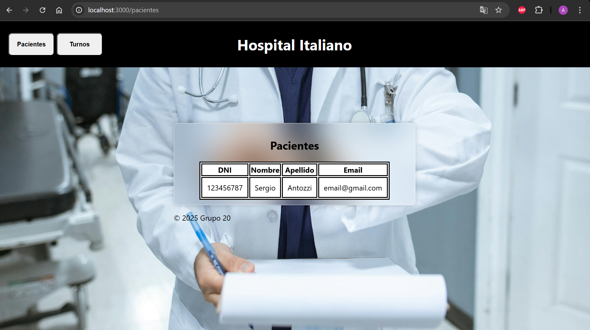
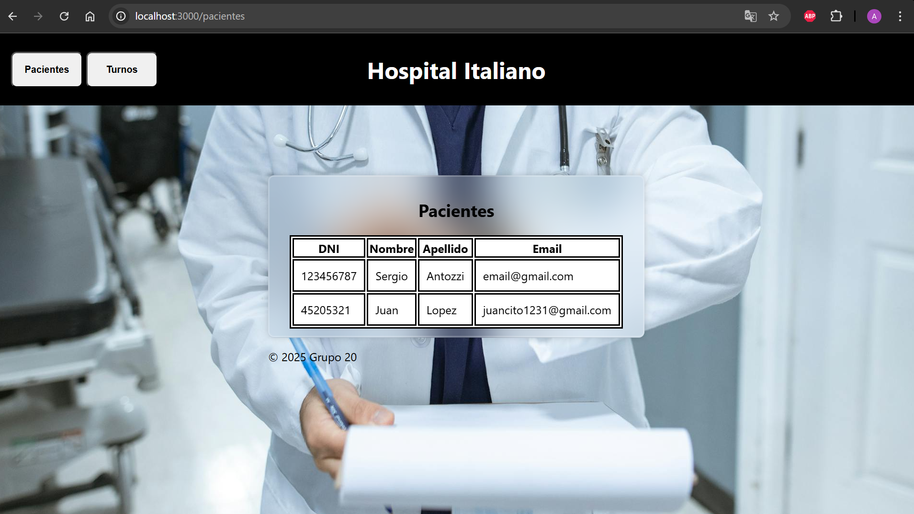
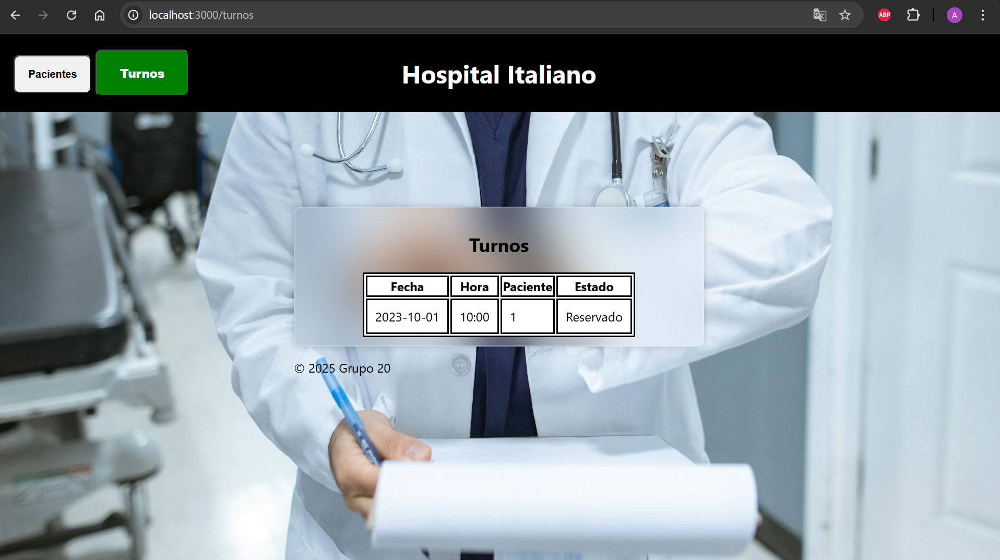

# TP3: Desarrollo de Aplicación de Turnos Médicos
Aplicación web desarrollada en Node.js y Express que permite gestionar pacientes y turnos médicos. Incluye funcionalidades de login, creación, modificación y eliminación de datos, con vistas dinámicas utilizando EJS.
---
## 👥 Integrantes del grupo:
- Felipe Fernandez
- Luciano Nicolas Lopez Gonzalez
- Agustin Barbero
- Juan Ignacio Tarsia

## 🚀 Instalación y uso

1. Clonar el repositorio:

```bash
git clone https://github.com/agustinbarbero/ProgramacionIII.git
cd .\TP3\
cd .\practico3progra3\
```

2. Instalar las dependencias:

```bash
npm install
```


3. Ejecutar el servidor en modo desarrollo:

```bash
npm run dev
```

Luego abrir en el navegador: [http://localhost:3000](http://localhost:3000)

---

## 📡 Endpoints

### 🧑‍⚕️ Pacientes

```
POST   /api/v1/pacientes/create        → Crear un paciente  
POST   /api/v1/pacientes/login         → Login de un paciente  
GET    /api/v1/pacientes               → Obtener todos los pacientes  
GET    /api/v1/pacientes/:id           → Obtener un paciente por ID  
PUT    /api/v1/pacientes/:id           → Modificar un paciente  
DELETE /api/v1/pacientes/:id           → Eliminar un paciente
```

### 📅 Turnos

```
POST   /api/v1/turnos/create           → Crear un turno  
GET    /api/v1/turnos                  → Obtener todos los turnos  
GET    /api/v1/turnos/:id              → Obtener un turno por ID  
DELETE /api/v1/turnos/delete/:id       → Eliminar un turno
```

---

## 🖼️ Capturas de pantalla de la vista

### Pacientes

**Antes de crear un paciente**:


**Después de crear un paciente**:


---

### Turnos

**Antes de crear un turno**:  


**Después de crear un turno**:  


---